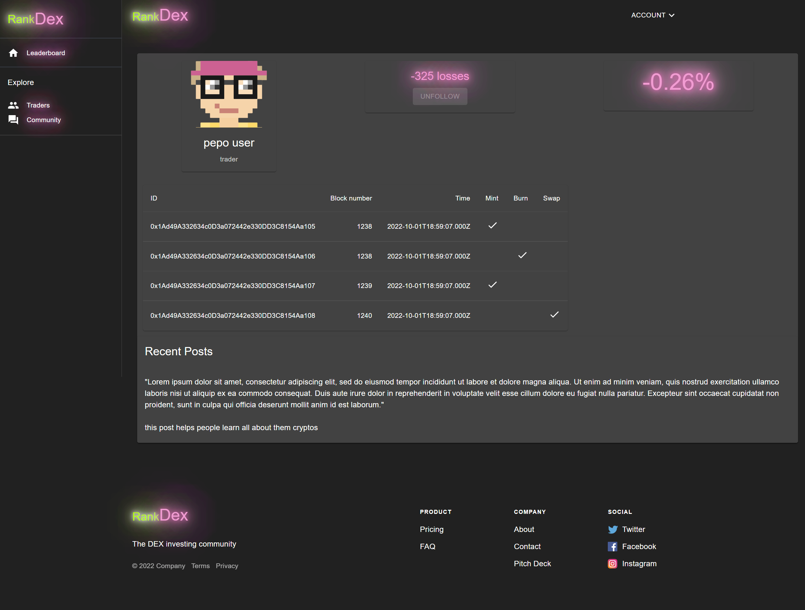
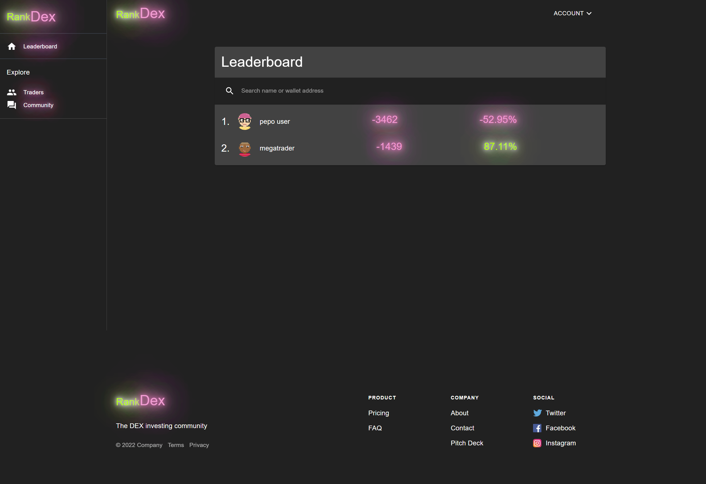

## Install instructions for RustFI hackathon

`yarn` or `npm install` to install the required dependencies

`npm install -g vercel` for the vercel deployment & local dev environment

`vercel dev` to run locally

The application builds & deploys on a git push to `master`

Apply database migrations to `supabase` via the CLI or the raw SQL query editor on their web app.

Note that a number of environment variables are required to run correctly

Chiefly: 
 - SUPABASE_PUBLIC_KEY
 - SUPABASE_SECRET_KEY
 - SUPABASE_URL
 - REACT_APP_SUPABASE_PUBLIC_KEY
 - REACT_APP_SUPABASE_URL

Demo [here](https://rankdex.vercel.app/)

Code for the backend lives [here](https://github.com/robinbernon/rustfi)

## Home Screen

## User View

## Leaderboard

